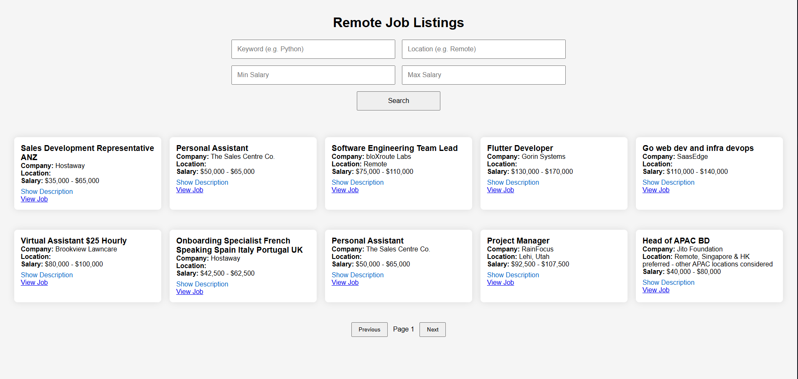
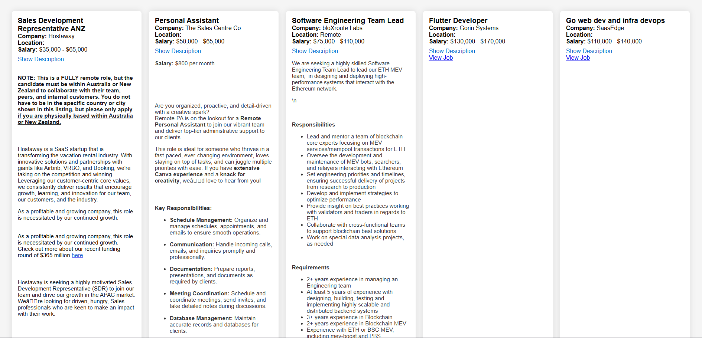

# Remote Job Scraper

A clean, responsive web app that scrapes and displays remote developer jobs — built with FastAPI and vanilla JavaScript. Designed to give tech job seekers a personal tool to search, filter, and explore listings efficiently without platform noise.

---

## Features

- Filter by **keyword**, **location**, and **salary range**
- Search through job **titles**, **companies**, and **descriptions**
- Expandable job descriptions
- Pagination for browsing results
- Responsive UI with adaptive layout
- Built with clean separation of frontend (HTML/CSS/JS) and backend (FastAPI)

---

## Tech Stack

- **FastAPI** (Python) — lightweight backend API
- **Requests** — scraping RemoteOK JSON API
- **Vanilla JavaScript** — dynamic frontend behavior
- **HTML/CSS** — fully responsive layout
- **Deployed Locally** — portable and quick to run

---

## Getting Started

1. **Clone the repository**
2. **Install dependencies**
   ```bash
   pip install -r requirements.txt
   ```
3. **Run the local FastAPI server**
   ```bash
   uvicorn app.main:app --reload
   ```
4. **Visit the UI**
   ```
   http://localhost:8000/
   ```

---

## Screenshots


### Job List


### Job Description Expanded


### Mobile/Small Window

---

## Why This Project?

Built to streamline my own job exploration as a developer, this project also serves as a full-stack showcase — covering scraping, API design, filtering logic, and dynamic frontend rendering.

---

## Potential Enhancements

- Tag filtering
- Save favorites (localStorage)
- Sort by newest or highest-paying
- Deploy publicly (with Render, Railway, Netlify, etc.)

---

## Folder Structure

```bash
job-scraper/
├── app/
│   ├── main.py
│   └── scraper.py
├── assets/
│   ├── screenshot1.png
│   ├── screenshot2.png
│   └── screenshot3.png
├── static/
│   ├── index.html
│   ├── styles.css
│   └── scripts.js
├── requirements.txt
└── README.md
```

